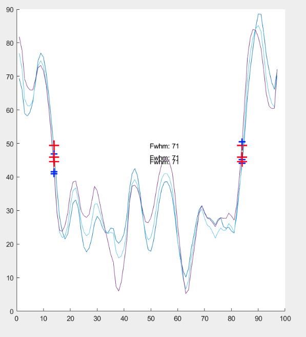

# The Project: Ultrasound-Modeling
FWHM Implementation and Image Processing on Cysts of Prostate Cancer Tissues, Design of Ultrasound Probes using Field-II Simulation Package

## Screenshots

Detecting Cyst Sizes

Resolving Cyst Depth From Ultrasound Using Signal Processing (FWHM)

Generating Artifical Cysts for Testing

Ultrasound Transducer Diagram

